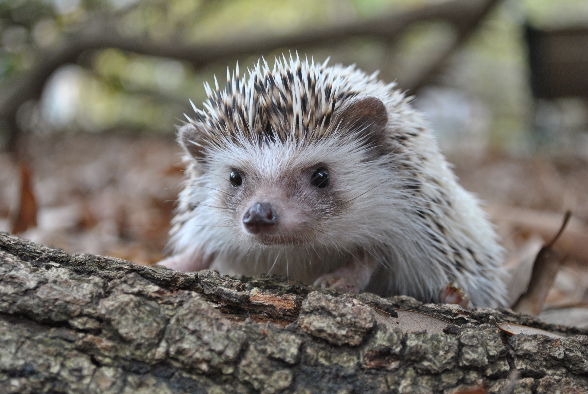

# Я - ёж обыкновенный

### Узнали красавца?

>Меня также называют среднерусским или европейским ежом. Но как не назови...

По природе своей я — сова. Днём мне хочется дремать дома свернувшись в клубок на уютный подстилке из травы и мха. А ночью я становлюсь грозным охотником. Почему-то меня считают насекомоядным, но я гроза не только всяких там гусениц и майских жуков.

Смотрите, на кого я могу охотиться и с кем вступить в схватку:

- мышь-полёвка;
- бурозубка;
- ящерица

    и... тада-дам!

- ## гадюка!!!

В общем, вреда от меня мало, а пользы много. Как говорится, 
## Ёжики — это не только ценный мех...

[Подробнее обо мне здесь] (https://ru.wikipedia.org/wiki/%D0%9E%D0%B1%D1%8B%D0%BA%D0%BD%D0%BE%D0%B2%D0%B5%D0%BD%D0%BD%D1%8B%D0%B9_%D1%91%D0%B6/)
### Читайте, наслаждайтесь!

